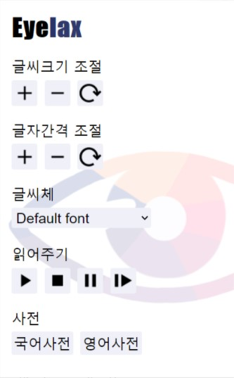
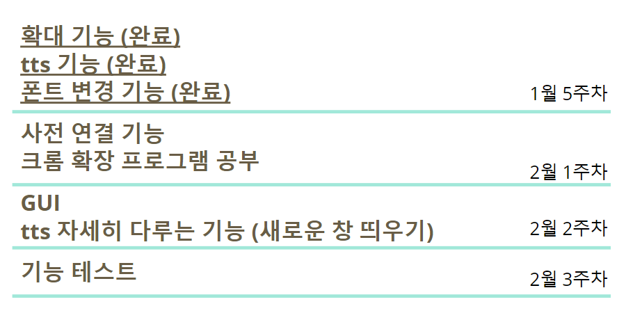

# Eyelax 

## 프로젝트 소개

>시각장애인 분들이나 노인, 난독증 환자들을 위해 다양한 기능을 제공해	웹페이지의 정보 이해를 돕는 프로그램이다. 

>글의 확대, 소리내어 읽어주기, 가독성 좋은 글씨로 바꾸기, 사전기능 등이 구현되어 있다. 

---

## 배경 및 문제현황

>PC사용이 증가하고 정보의 공유와 소통 등 대부분이 인터넷 통해 이루어지고 있다. 
상대적으로 많은 정보를 한 화면에 보여주는 pc의 특성상 시야가 좁거나 글을 읽는데에 어려움이 있는 사람들은 정보에 접근하기가 어렵다. 

>저시력 시각장애인이나 노인 분들을 화면에 표시되는 글씨가 작거나 알아보기 힘든 색으로 이루어져 있으며 특히 낯선 신세대 용어의 사용으로 노인분들을 웹페이지 글의 이해가 어렵다. 

---

## 프로젝트 대상

>인터넷 웹페이지 사용에 어려움을 겪고 있는 시각장애인, 노인, 난독증 환자 분들을 대상으로 한다. 

---

## 기대하는 효과

>노인분들이 PC사용에 익숙해지며 세대간 원활한 소통이 이루어지는 것을 기대한다. 

>회사 업무가 보통 이메일로 이루어지는데 저시력 장애인 분들이나 난독증 환자들은 업무 지시를 이해하는데 오랜 시간이 걸려 난처한 상황을 해결 할 수 있을 것으로 본다. 

---

## 

---

## 프로젝트 팀원 소개
 >유수민 전하은 정라엘

 ---

## 프로젝트 기능 소개

### TTS
  #### 기능 소개
  #### `tts를 구현하는 이유`
  >노인분들과 난독증 환자 등 글씨를 읽는데 어려움을 겪는 사람들을 위해, 시각적인 자료가 과다한 인터넷을 청각적인 자료로 바꿔주는 것을 목표로 한다.

  #### `구현된 기능`
  >재생, 정지, 일시정지, 이어서 읽기

  #### `개선해야할 점`
  - 언어를 한국어로 설정했기 때문에, 영어를 발음할 때 콩글리쉬로 발음한다. 그래서 언어를 감지해서 언어가 자동으로 변경되는 기능이 필요하다.

  #### `시행착오`
  - 크롬에서 window.speechSynthesis를 사용하여 읽도록 하면, 최대 60자만 읽을 수 있다. 이것을 방지하기 위해 시간 초 단위로 pause()와 resume()을 반복하여 긴 글을 읽을 수 있도록 하였다.

  ### 구현 과정
  - eSpeak (tts 기능 오픈소스)를 이용하려고 했으나, 소스파일을 확장프로그램과 연결시키는데 실패.
  - Speak It (tts 확장 프로그램)을 이용하려 했으나, 한국어 지원이 되지 않음.
  
    -> 인터넷 서치를 통해 플로그인 없이 작동하는 TTS를 구현함.
       드래그 한 부분을 텍스트로 변경시키기 위해, 인터넷 서치로 다양한 코드들을 시도해보았지만 아직 구현하지 못함.
  - Zoom on doubleclick, 호버 줌+ (돋보기 확장 프로그램)을 이용하여 UI 및 작동 방식을 참고하였습니다.
    
  ---

### Font change
  #### 기능 소개
  #### `폰트 변경을 구현하는 이유`
  >웹페이지 내 너무 글씨가 너무 작으며, 폰트색과 배경색이 비슷하여 구분이 어려워 글자를 알아보기 어렵기 때문에, 이것을 해결하고자 한다. 또한 가독성이 떨어지는 글씨체가 존재하기 때문에 폰트 변경을 하려고 한다.

  #### `구현된 기능`
  >글자 크기 조절(+/-), 글자 간격 조절(+/-), 글씨체 변경 기능

  #### `현재 진행 상태`

   
  #### `개선해야할 점`
  - 글자 간의 간격을 조절하는 기능은 특히 네이버처럼 글씨가 들어갈 곳이 정해져 있는 곳에선 글자의 간격이 넓어지지 않고 줄어드는 현상을 보인다. (구글에선 잘 작동한다)

  #### `시행착오`
  - 글씨크기와 글자 간격을 조절하는 기능은 잘 작동하지만 단어 사이의 간격을 조절하는 기능을 작동하지 않아 구현하지 않았다.

  ### 구현 과정
  - 처음엔 난독증 환자들에게 도움이 된다고 개발된 글씨체를 적용하려고 하였으나,
  - 난독에 도움되는 글씨체는 영,미권에서 발달이 되어있고 한국에서는 난독증에 도움이 되는 이렇다할 글씨체가 없었다 
  - 개발된 한글 난독증 서체 : 일반적인 서체를 만드는 타입 디자이너가 아무리 노력해도 감지할 수 없는 미지의 영역이란 느낌을 준다. 또한 난독증에 도움이 되는 영어글씨체는 일반인이 글을 읽기 힘들게 만들었기에 역효과라고 판단, 글씨체 변경 기능을 글씨 크기와, 글씨 색 변경 기능으로 가독성을 높이는 기능으로 바꾸게 되었다. 
  
  ---

### Dictionary(예정)
  #### 기능 소개
  #### `사전을 구현하는 이유`
  >신조어나 한자 등으로 인터넷 사용에 불편함을 겪는 것을 해소하기 위하여 단어의 뜻을 검색하지 않아도 바로 알려주는 사전을 구현한다.

  #### `구현된 기능`
  >국어사전, 영어사전
  
  #### `개선해야할 점`
  >신조어나 한자 등으로 인한 불편함 해소를 위함이다.
  >단어의 뜻을 검색하지 않아도 바로 알려주는 사전을 구현한다.

  
  

---
## 일정
